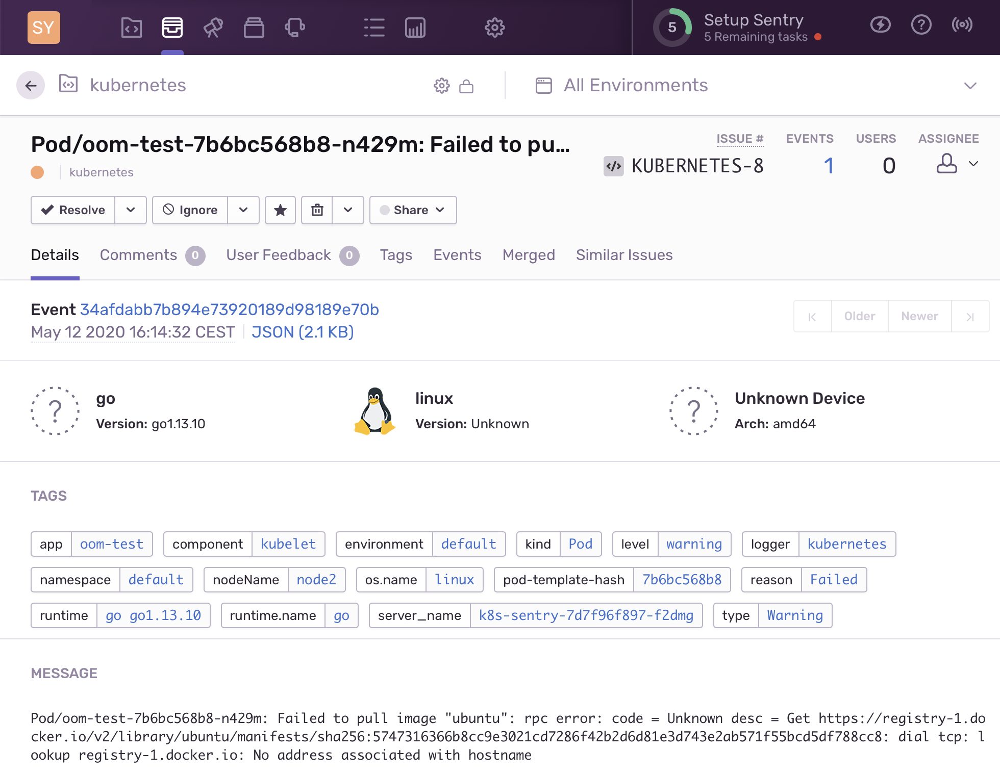

# k8s-sentry

_k8s-sentry_ is a simple tool to monitor a [Kubernetes](https://kubernetes.io) cluster and report all operational issues to [Sentry](http://sentry.io).



There are two alternatives implementations:

- [getsentry/sentry-kubernetes](https://github.com/getsentry/sentry-kubernetes): The official Sentry kubernetes reporter. This is not actively maintained and suffers from a [major memory leak](https://github.com/getsentry/sentry-kubernetes/issues/7).
- [stevelacy/go-sentry-kubernetes](https://github.com/stevelacy/go-sentry-kubernetes): An alternative go implementation. This watches for Pod status changes only. This causes it to several event types (missing volumes, ingress errors, etc.).

_k8s-sentry_ watches for several things:

- All warning and error events
- Pod containers terminating with a non-zero exit code
- Pods failing completely

## Deployment

See [deploy](deploy/) for Kubernetes manifests and installation instructions.

## Configuration

Configuration is done completely via environment variables.

| Variable | Description |
| -- | -- |
| `SENTRY_DSN` | **Required** DSN for a Sentry project. |
| `SENTRY_ENVIRONMENT` | Environment for Sentry issues. If not set the namespace is used as environment. |
| `NAMESPACE` | Comma separated set of namespaces to monitor. If not set all namespaces are monitored (as far as permissions allow) |
| `EXCLUDE_NAMESPACE` | Comma separated set of namespaces to not monitor. If `NAMESPACE` is also set, namespaces are excluded from that else from all namespaces|

## Issue grouping

_k8s-sentry_ tries to be smart about grouping issues. To handle that several strategies are used:

- all issues use the event type, event reason and event message as part of the fingerprint
- events related to controlled Pods (for example Pods created through a ReplicaSet (which is
  automatically done if you use a StatefulSet or Deployment) are grouped by the ReplicateSet.
- other events are grouped by the the involved object

## Building

This project uses [Go modules](https://github.com/golang/go/wiki/Modules) and requires Go 1.13 or later. From a git checkout you can build the binary using `go build`:

```shell
$ go build
go: downloading k8s.io/apimachinery v0.0.0-20191020214737-6c8691705fc5
go: downloading k8s.io/client-go v0.0.0-20191016111102-bec269661e48
go: downloading k8s.io/api v0.0.0-20191016110408-35e52d86657a
...
```

You can then run `k8s-sentry` directly (assuming you have a valid kubectl configuration):

```shell
$ ./k8s-sentry
2019/10/22 15:55:41 Warning: DSN environment variable not set. Can not report to Sentry
2019/10/22 15:55:41 Warning HorizontalPodAutoscaler/istio-ingressgateway: unable to get metrics for resource cpu: no metrics returned from resource metrics API
2019/10/22 15:55:41 Warning HorizontalPodAutoscaler/istio-pilot: unable to get metrics for resource cpu: no metrics returned from resource metrics API
```
